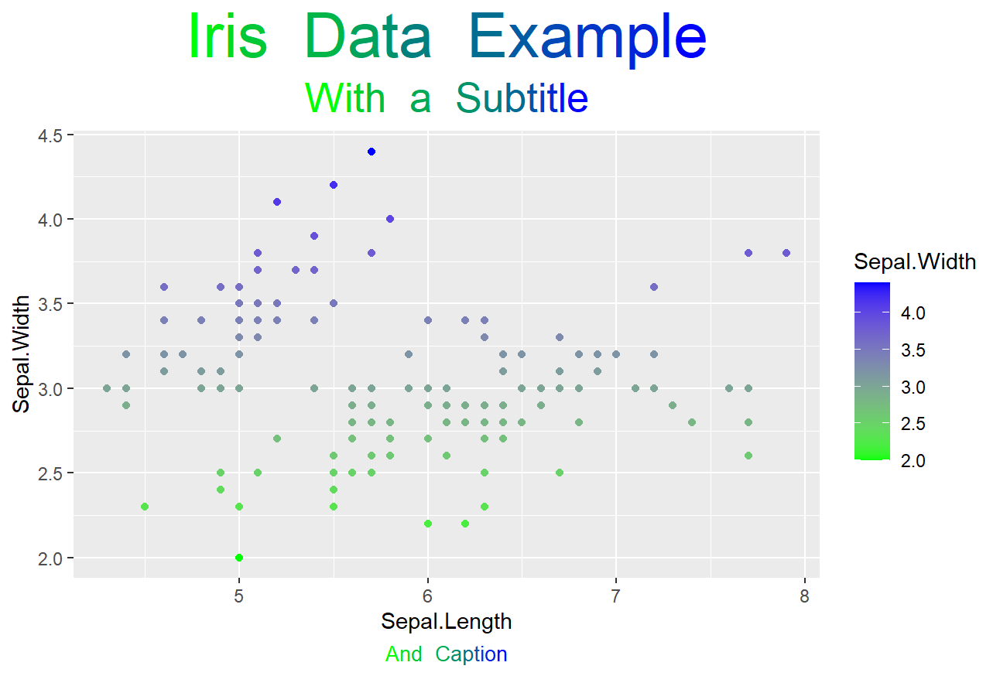
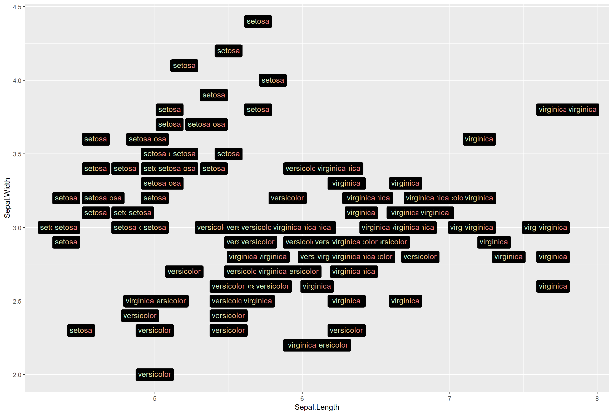

# <span style='color:#D38312;'>g</span><span style='color:#CF7B1B;'>r</span><span style='color:#CB7424;'>a</span><span style='color:#C76C2E;'>d</span><span style='color:#C36537;'>i</span><span style='color:#BF5E40;'>e</span><span style='color:#BB564A;'>n</span><span style='color:#B74F53;'>t</span><span style='color:#B3485C;'>t</span><span style='color:#AF4066;'>e</span><span style='color:#AB396F;'>x</span><span style='color:#A83279;'>t</span>

gradienttext is an R package that works with the [`ggtext`](https://github.com/wilkelab/ggtext) package to create gradient text labels on ggplot graphs. 

You can install the development version of gradienttext from GitHub with:
```
# install.packages("devtools")
devtools::install_github("samiaab1990/gradienttext")
```

<b>Note:</b> `ggtext` and `ggplot2` must be already installed for the `make_gradient()` function in the package to work. 

# Examples

## Applying gradient colors to titles, subtitles and captions. 

```
library(gradienttext)
library(ggplot2)
library(ggtext)


ggplot(data = iris, aes(x = Sepal.Length, y= Sepal.Width))+
geom_point()+
labs(title = make_gradient(string_lab = "Iris Data Example", colors=c("green","blue")))+
theme(
plot.title = element_markdown(size=30, hjust=.5)
)
```



## Applying gradient colors to aesthetic mapping

```
library(gradienttext)
library(ggplot2)
library(ggtext)

colors = c("#C6FFDD","#FBD786","#f7797d")
ggplot(data = iris, aes(x = Sepal.Length, y= Sepal.Width))+
geom_point()+
geom_richtext(aes(label = make_gradient(string_lab=Species, colors=colors)), fill="#000000")
```


## Applying gradient colors to text labels in general

```
library(gradienttext)
library(ggplot2)
library(ggtext)
library(tibble)

random_dat = tibble(x = 5, y=5)
ggplot(data = random_dat, aes(x=x,y=y))+
geom_point()+
geom_richtext(label=make_gradient(string_lab ="this is a label", colors=c("#FBDA61","#BD5AFF")), fill="#000000", size=5)
```

